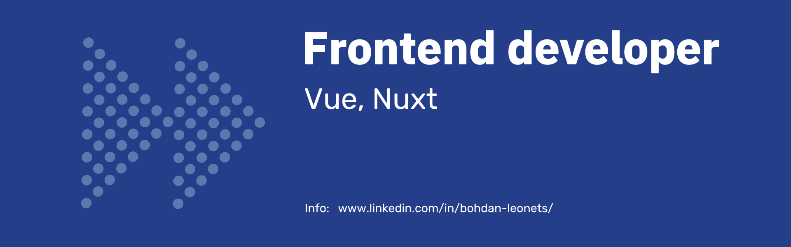

<h1 align="center">Hi there 👋, I'm Bohdan Leonets</h1>
<h3 align="center">Frontend developer</h3>

  <picture width="25" height="25">
    <source media="(prefers-color-scheme: dark)" srcset="./assets/skateboarding-dark.gif#gh-dark-mode-only">
    <source media="(prefers-color-scheme: light)" srcset="./assets/skateboarding-light.gif#gh-light-mode-only">
    
  </picture>
  
  

  

- 🌱I am currently in the process of diving into and practising: **Nuxt** 

<h2 align="center">Languages :</h3>

| 🇺🇦 **Ukrainian** - Native | 🇬🇧 **English** - Intermediate |
|---------------------------|------------------------------|
| 🇩🇪 **German** - Pre-Intermediate | 🇵🇱 **Polish** - Pre-Intermediate |

<!--
Here are some ideas to get you started:

- 🔭 I’m currently working on ...
- 🌱 I’m currently learning ...
- 👯 I’m looking to collaborate on ...
- 🤔 I’m looking for help with ...
- 💬 Ask me about ...
- 📫 How to reach me: ...
- 😄 Pronouns: ...
- ⚡ Fun fact: ...
-->
